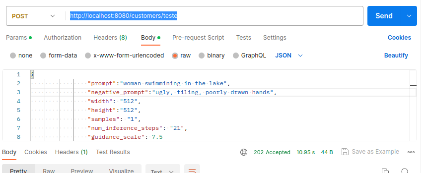
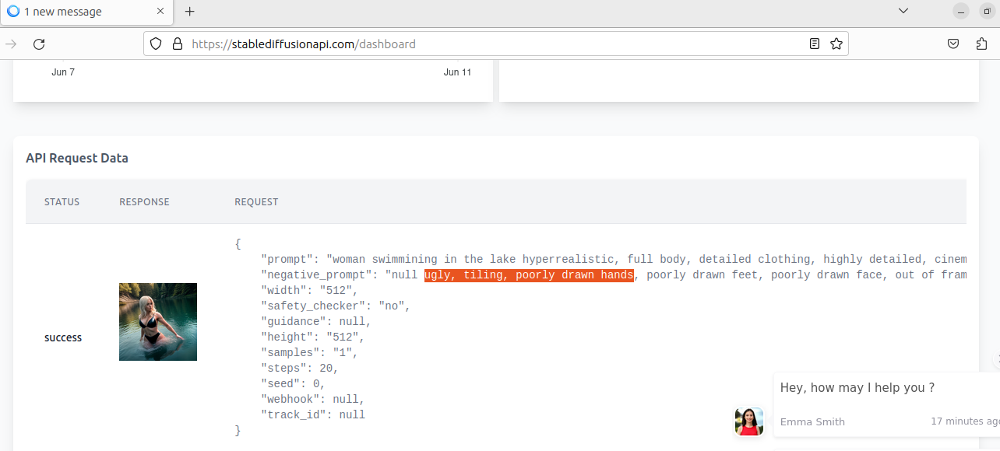

###Exemplo Avatar com Quarkus usando StableDiffusionAPI

Este programa é um exemplo de api geradora de imagens que utiliza a api do site [Stable Difusion API ](https://stablediffusionapi.com)

Primeiramente Clone o repositorio

Depois se cadastre no site acima, após o cadastro você pode optar por utilização gratuita que da direito a geração de 
20 imagens sendo elas gerados no proprio site,ou fazer um plano pago se quiser mais imagens usando mais recursos da api,
as imagens geradas são disponibilizadas na aba de dashboard do site, apesar da documentação informar um response que retornaria a imagem
, isso não ocorre, por isso é necessário o cadastro pra poder visualizar a imagem na aba de dashboards do site da api, 
alem de gerar a key para usar na  requisição que é gerada na aba de playground.

Após gerar a key substitua a key no arquivo ProfilePhoto.java dentro de domain/models
pela  key gerada pelo site para que as fotos sejam salvas no seu perfil do
Stable Diffusion API 

Após isso execute os seguintes comandos na pasta do projeto.

````
mvn package
sudo docker build -f src/main/docker/Dockerfile.jvm -t quarkus/avatar-jvm .
sudo docker run -i --rm -p 8080:8080 quarkus/avatar-jvm
````

exemplo de requisição json da minha aplicação para usar no postman.


Substitua "teste" pelo valor que quiser
```
{
"prompt":"woman swimmining in the lake",
"negative_prompt":"ugly, tiling, poorly drawn hands",
"width":"512",
"height":"512",
"samples":"1",
"num_inference_steps":"21",
"safety_checker":"no",
"enhance_prompt":"yes",
"guidance_scale":7.5
}
````
Exemplo do response no site da Stable Diffusion API


